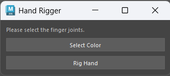

# Maya Rigging Tools 
----------------------------------------------------------------------- 

## 

## Tech Stack 
|tool  |version| 
|--------|----------| 
|Python|3.12  | 
|Pyside| 6   | 
|Maya|>=2025| 

## Limb Rigger 

 

* Rig arms and legs with ease with ikfk blend included 

## Hand Rigger 

 

* Rig each finger, one at a time easily
* Allowing the user to control the finger by the joint
